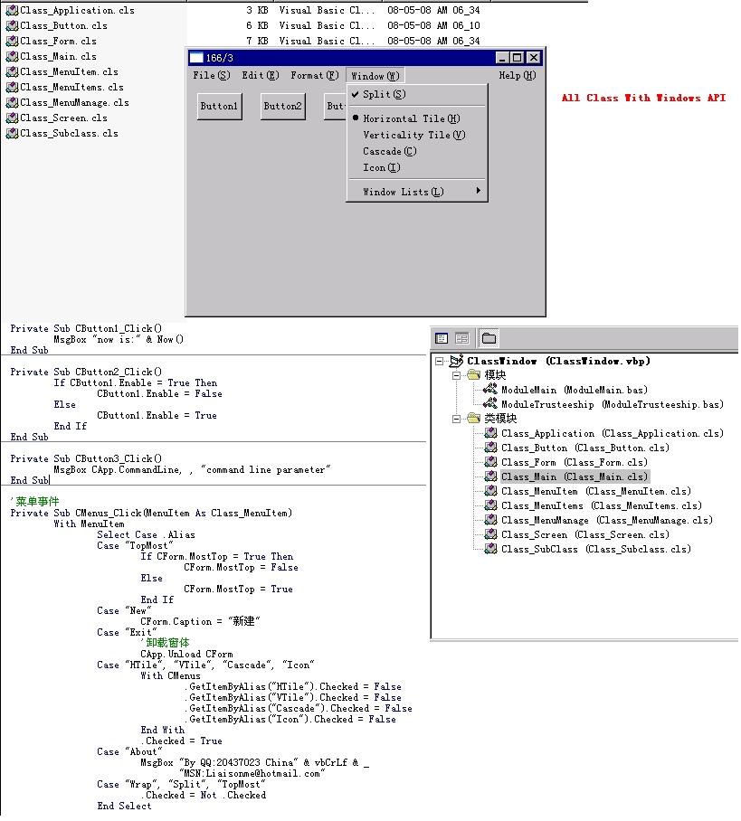



## VB6 Clone Form&amp;Button&amp;Menu\(Only Class and Module File,Pure API\)

### Description

Class VB6,Support Form Button and Menu,Only Windows API
 
### More Info
 

             |
---                |---
**Submitted On**   |2006-12-10 01:49:22
**By**             |[boyzhang](https://github.com/Planet-Source-Code/PSCIndex/blob/master/ByAuthor/boyzhang.md)
**Level**          |Advanced
**User Rating**    |5.0 (60 globes from 12 users)
**Compatibility**  |VB 6\.0
**Category**       |[Libraries](https://github.com/Planet-Source-Code/PSCIndex/blob/master/ByCategory/libraries__1-49.md)
**World**          |[Visual Basic](https://github.com/Planet-Source-Code/PSCIndex/blob/master/ByWorld/visual-basic.md)
**Archive File**   |[VB6\_Clone\_211203572008\.zip](https://github.com/Planet-Source-Code/boyzhang-vb6-clone-form-amp-button-amp-menu-only-class-and-module-file-pure-api__1-70507/archive/master.zip)

